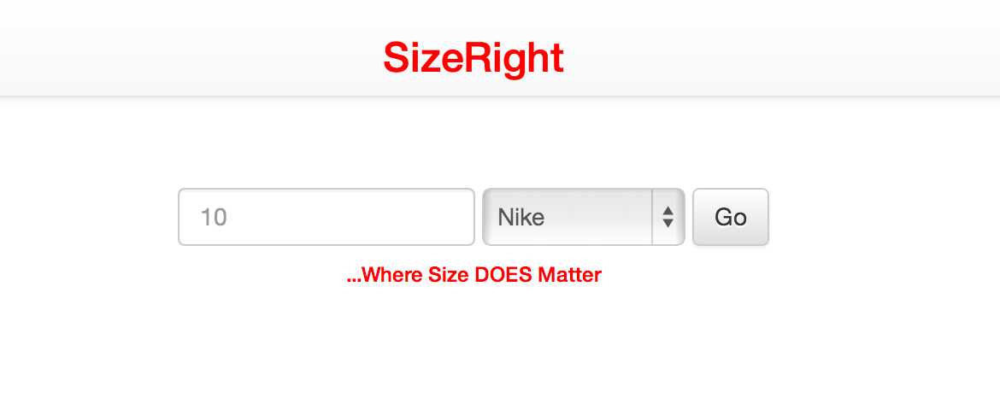

#SizeRight Readme
A shopping tool to help you find your sneaker size across all major brands.


[SizeRight](http://sizeright.herokuapp.com)
***



###APIs and Gems Used
API:

- Amazon Product Advertising

Gems:

- PG
- Vacuum
- Devise

###User Experience
Users enter their current sneaker size and brand.

Brings up images of different brands with corresponding sizes appended to them. 

Users can click on an image to view top sneakers selling sneakers on amazon for respective brand. Image is a link and takes you to that item on amazon.
###Code Sample
```
def create
    @brand_name = params[:brand_name]
    @base_size = params[:base_size].to_f
    session[:sneaker_ids] = []
    @brands = Brand.all
      case @brand_name
        when "Puma"
          @base_size = @base_size - 0.5
        when "Converse"
          @base_size = @base_size + 0.5
        when "New Balance"
          @base_size = @base_size + 0.5
        when "Asics"
          @base_size = @base_size - 0.5
        when "Saucony"
          @base_size = @base_size + 0.5
      end
    @brands.each do |brand|
      session[:sneaker_ids] << Sneaker.create(base_size: @base_size, brand_name: brand.name, brand_id: brand.id, shoe_size: @base_size + brand.conversion).id
    end
```